# 1. Setup
## Requirements
- Python 3.12.10
- Docker Desktop

## Virtual Python env
- python -m venv venv
- .\venv\Scripts\activate
- pip install -r requirements.txt --constraint "https://raw.githubusercontent.com/apache/airflow/constraints-3.1.6/constraints-3.12.txt"


## requirements.txt
```
pandas
apache-airflow-providers-amazon
faker 
boto3
apache-airflow-providers-snowflake
```

## Running Airflow in Docker
- Docs: https://airflow.apache.org/docs/apache-airflow/stable/howto/docker-compose/index.html
- Download docker-compose.yaml template: **curl.exe -LfO 'https://airflow.apache.org/docs/apache-airflow/3.1.6/docker-compose.yaml'**
- Update the .yaml file same as one in the project, and add Dockerfile also.

Add airflow-webserver to docker .yaml 
```
airflow-webserver:
    <<: *airflow-common
    command: webserver
    ports:
      - "8081:8080"  # We use 8081 because apiserver is already using 8080
    healthcheck:
      test: ["CMD", "curl", "--fail", "http://localhost:8080/health"]
      interval: 30s
      timeout: 10s
      retries: 5
      start_period: 30s
    restart: always
      <<: *airflow-common-depends-on
      airflow-init:
        condition: service_completed_successfully
```

Create default directories and .evn
- mkdir dags, logs, plugins, config
- Set-Content .env "AIRFLOW_UID=50000"

Init airflow
- docker compose up airflow-init

Run airflow
- docker compose build (To build the Dockerfile. Need to run this again for any change to affect)
- docker compose up -d --remove-orphans


## Minio S3 setup
- mkdir minio/data
Add the MinIO config to docker .yaml
```
  minio:
    image: quay.io/minio/minio
    container_name: minio-server
    ports:
      - "9000:9000"
      - "9001:9001"
    environment:
      MINIO_ROOT_USER: admin
      MINIO_ROOT_PASSWORD: password
    volumes:
      - ${AIRFLOW_PROJ_DIR:-.}/minio/data:/data
    command: server /data --console-address ":9001"
    restart: always
```

Open your browser to http://localhost:9001. Log in using the default admin:password.

Add Minio connection to Airflow:
- Connection ID: minio_conn
- Connection Type: Amazon Web Services
- AWS Access Key ID: admin
- AWS Secret Access Key: password
- Extra Field JSON: { 
    "endpoint_url": "http://minio:9000",
    "addressing_style": "path" 
}

## Snowflake setup
- You need to create your Snowflake account and add these information to .env. The code below is just for example, update it to your correct account.
```
SNOWFLAKE_ACCOUNT=HXWHSMH-EH06866 -- Update this
SNOWFLAKE_USER=ImaginysLight -- Update this
SNOWFLAKE_PASSWORD=password -- Update this
SNOWFLAKE_ROLE=DATA_ENGINEER
SNOWFLAKE_WAREHOUSE=DEMO_WH
```

- Folder "snowflake_init_scripts" contains sql scripts that need to run directly on Snowflake website.
- Run **snowflake_init_scripts/warehouse_init.sql** then **snowflake_init_scripts/bronze_init.sql** to create a DEMO_WH and DEMO_DE_PROJECT_DB with all schema and table for Bronze layer. 
- Remember to change the last line in **snowflake_init_scripts/warehouse_init.sql** to your user name
```
GRANT ROLE DATA_ENGINEER TO USER ImaginysLight; -- Change ImaginysLight to your user name
```
- Your Snowflake DB structure should looks like this:

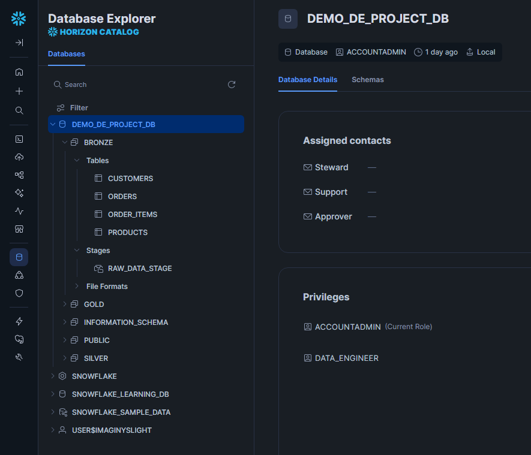

- You also need to add new Airflow connection named **snowflake_conn** so the **dag_ingest_data_to_snowflake.py** can run PUT and COPY INTO the Bronze tables.
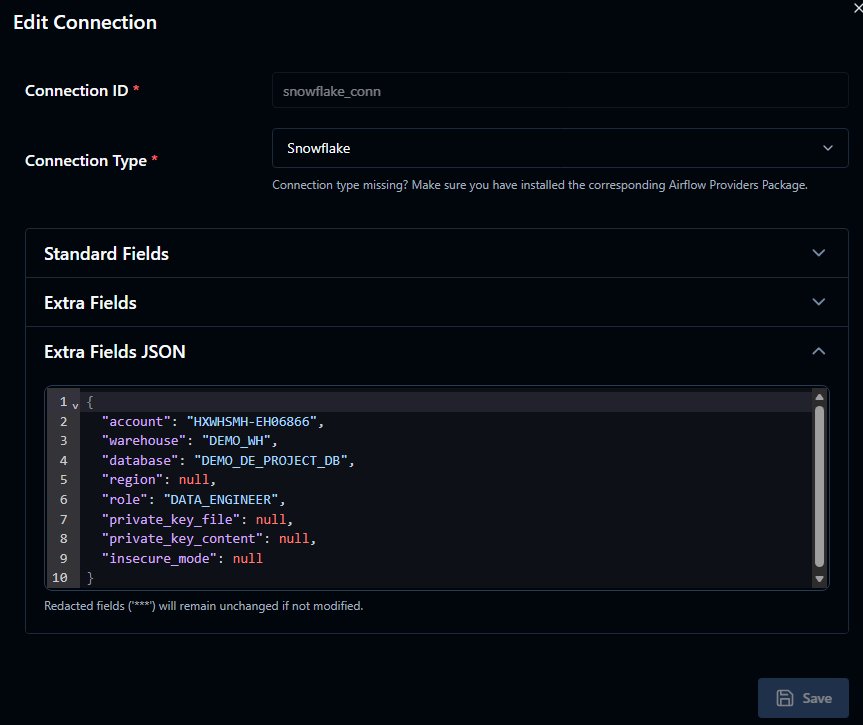

# 2. Execute
- This is the general flow of this project

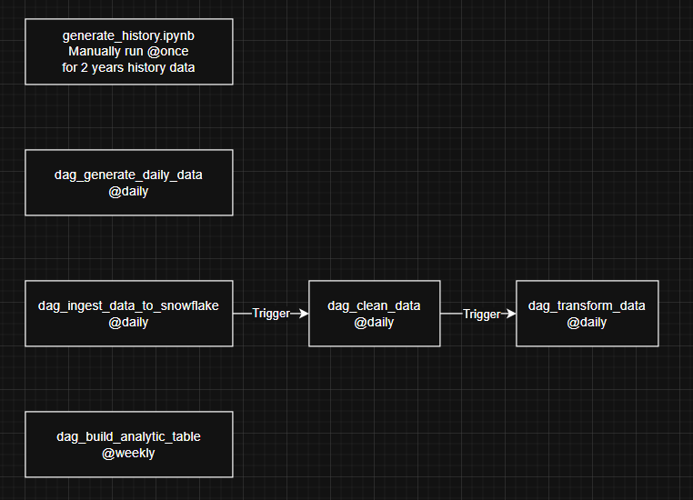

## A. Generate CSV data
- Firstly, run the code in **generate_history.ipynb** to generate historical data from 2 years to the previous month, and save it to the **bronze** folder in S3 bucket **demodeproject**. This data will contain corrupt rows randomly, so we can implements warn and error handling later. 
- The destination file path will look like **{BUCKET_NAME=demodeproject}/raw_data/orders/load_date=2025-02-06/orders_01D40CFEEF75.csv**

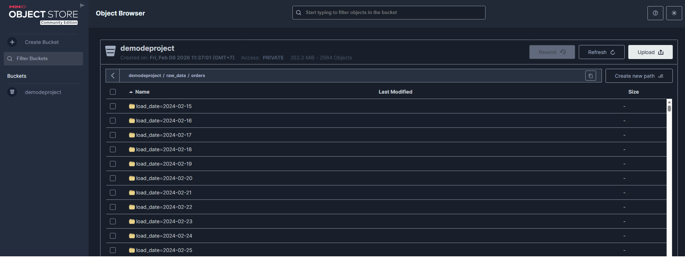
- Below is a .csv order file that contains invalid data

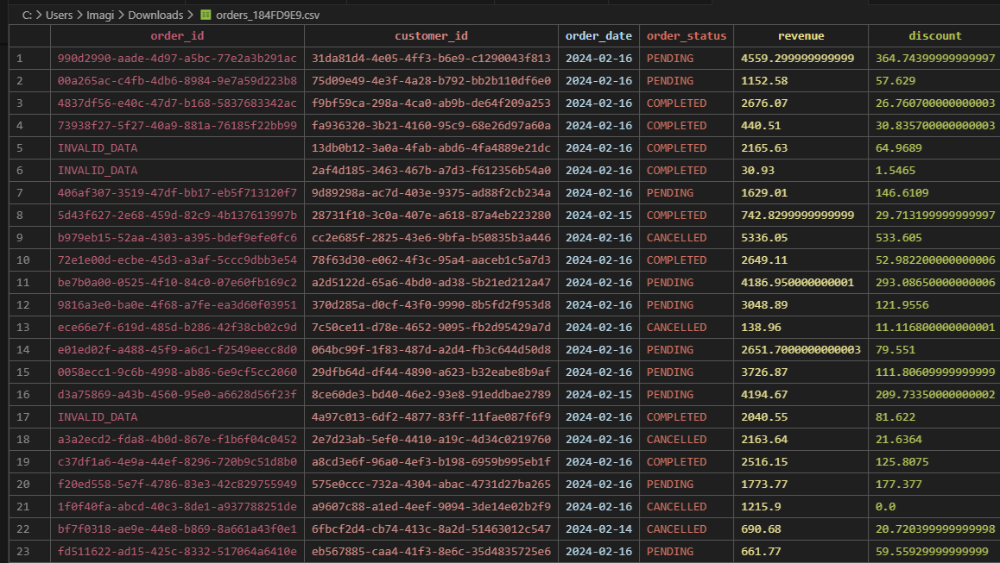

- Secondly, we use Airflow **DAG_generate_daily_data.py** with start_date = 30 days ago with catchup mode, to generate new data every day that contains chaos **order_items** with late arrival **orders**, and existing **customers** with **city** changed

## B. Bronze layer: Ingest data to Snowflake
- We run DAG **dag_ingest_data_to_snowflake.py** daily to download the coresspond daily data from MinIO S3 folder and insert it to Snowflake Bronze tables.

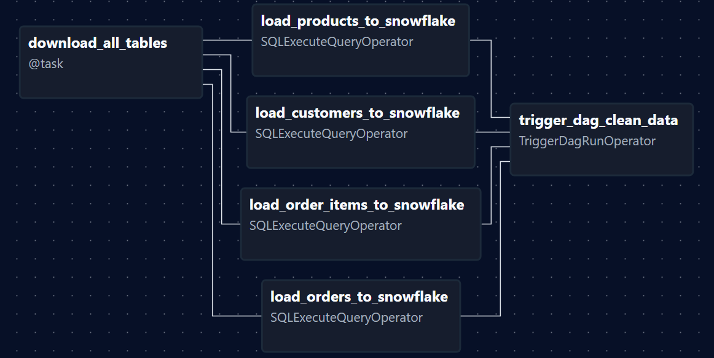
- Since we use local S3 and Snowflake cannot see the files, we need to PUT it to Snowflake first. If we have cloud storage, we can setup External Stage in Snowflake and use COPY INTO directly.

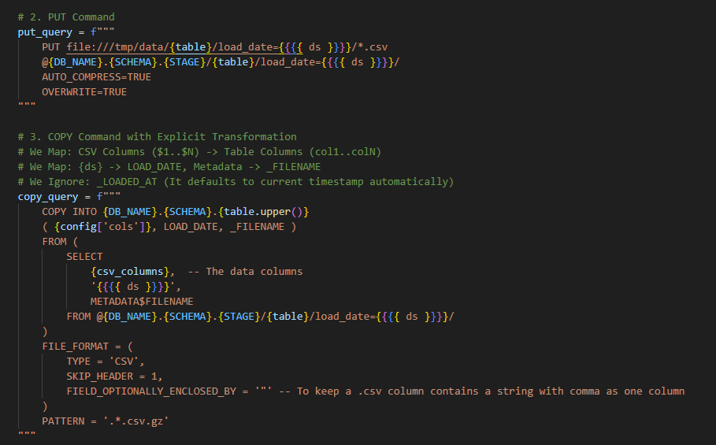
- Besides the columns from .CSV data files, we add new metadata columns LOAD_DATE and _FILENAME to help debugging when error occurs
- After **dag_ingest_data_to_snowflake.py** completed, it will automatically trigger **dag_clean_data.py**

## C. Silver layer: Clean data
- After ingest data completed, the DAG **dag_clean_data.py** will be triggered to clean data for that day
- We will use DBT from this point, code for this Silver layer mainly inside **dbt_project/models/staging** folder

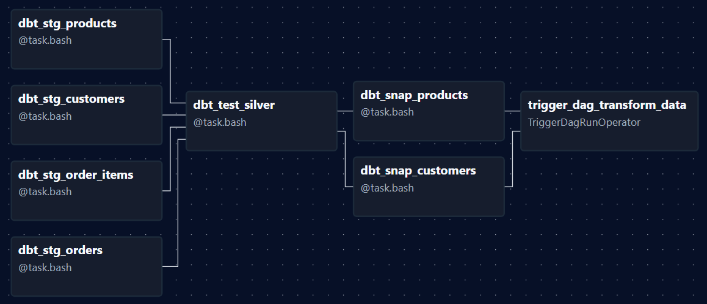
- We create Staging SQL with **stg_** prefix for each table, and the quality check inside **dbt_project/macros/get_quality_logic.sql**
- If record does not pass the quality check, we will save it in Quarantine table instead of Staging table
- Customers and Products are materialized as Table, while Orders and Orders_items are Incremental
- Then we run **dbt_test_silver** that is the conditions inside **dbt_project/models/staging/schema.yml**
- Now the data is correct, we know Customers and Products can change its information, so we implements SCD type 2 for it, using the SQL in **dbt_project/snapshots** folder
- It will create snapshot tables that track all records for each unique **cusomter_id** and **product_id**, then add some new **DBT_** prefix columns

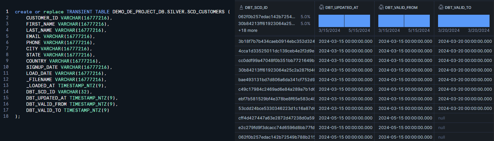
- We can get the newest record that has **DBT_VALID_TO** is null
- After **dag_clean_data.py** completed, it will automatically trigger **dag_transform_data.py**

## D. Gold layer: Transform data
- After clean data completed, the DAG **dag_transform_data.py** will be triggered to transform data for that day

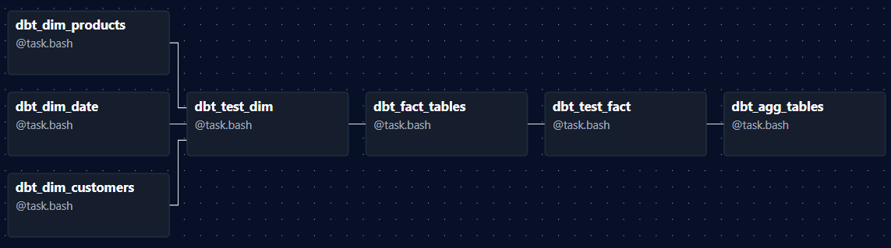
- Code for this Gold layer mainly inside **dbt_project/models/marts/core** folder
- Here we will use Star schema with **fact_sales** in the center, contains all the **order_items** information with PK to Dimension **customers, products, date**
- We use package **dbt_utils.date_spine** in **dim_date.sql** to dynamically generate new date for the next 2 years.

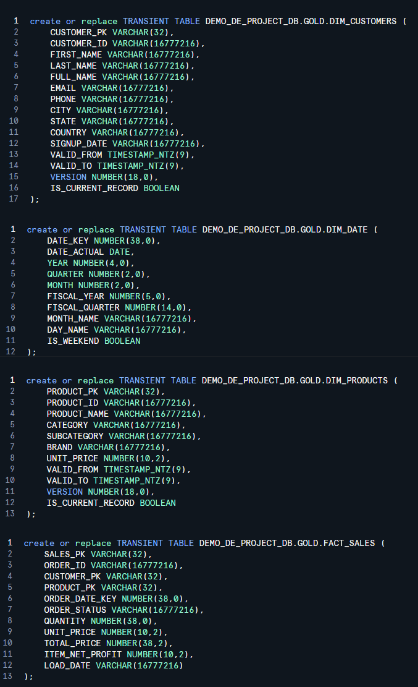
- Now we have all the necessary data for analytic, and we can make the performance better by creating Aggregation tables **agg_montly_product.sql** and **agg_customer_value.sql**. This will help calculating the quarterly and yearly Revenue faster, as well as analytic that depends on product Category, Brand or Customer.
- Just remember that because the **orders** record can be late-arrival, some record in **fact_sales** may have customer_pk = -1 and order_status = UNKNOWN

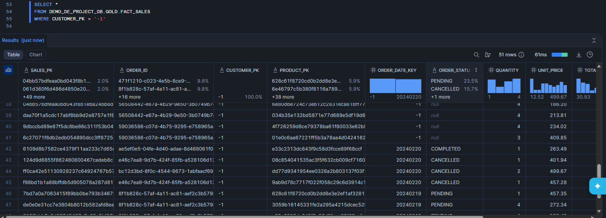
- You may ask why some records above have Status but Customer_PK still **-1**. It's because we have INVALID_DATA from the source .CSV in S3 already.

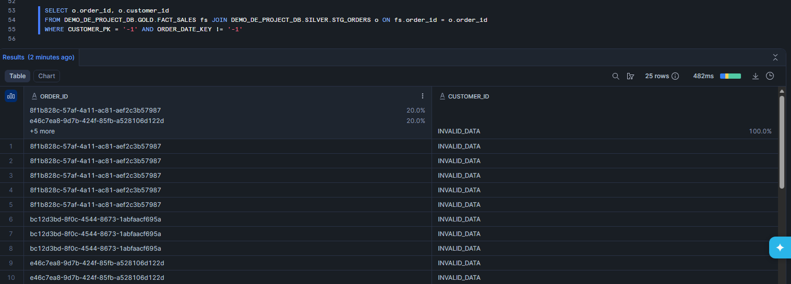
- But we don't quarantine it, because the Order is existed and the customer may paid money already, so delete it will cause incorrect Revenue in report dashboard.

## E. Analytic Report
- Since we have the aggregation tables, we can easily connect our Snowflake to PowerBI and draw some statistic charts
- Let's connect Power BI to our Snowflake database and add 2 AGG tables

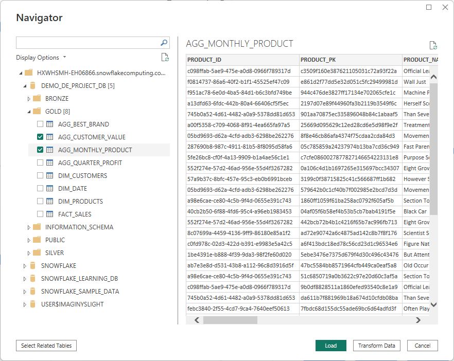
- For example we want a chart shows top 10 brands in 2024. Go to Transform Data and create a reference from table **agg_monthly_product**, name the new table as TOP_BRAND_2024

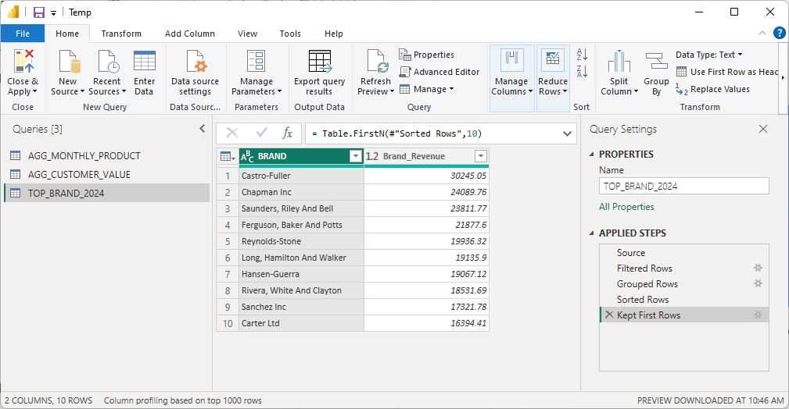
- Now we can apply filters to it:
  + Filtered Rows: Filter the column **Year** in 2024.
  + Grouped Rows: Group by Brand, and Sum by Net_Revenue

  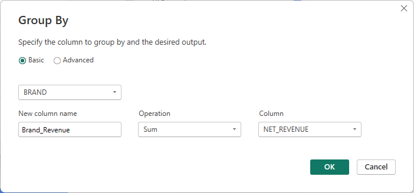
  + Sorted Rows: Sort DESC by Brand_Revenue
  + Keep First Rows: Keep 10 first rows to get top 10
- Now we have TOP_BRAND_2024 table with BRAND and Brand_Revenue columns, drag it to the Stacked Bar Chart and we have our top 10 brands in 2024.

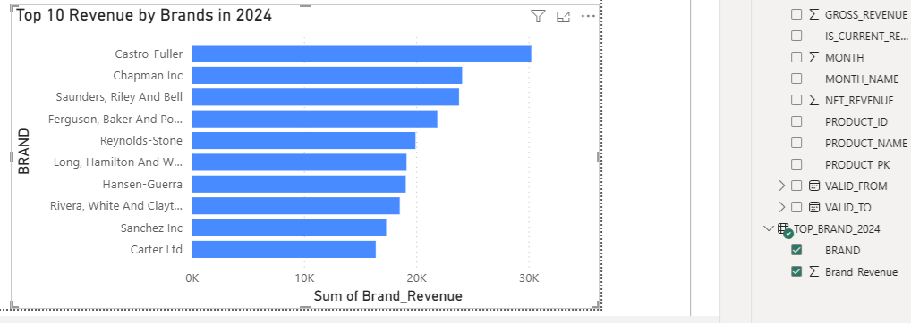
- And with the 2 aggregate tables, we can easily get some basic statistic like this

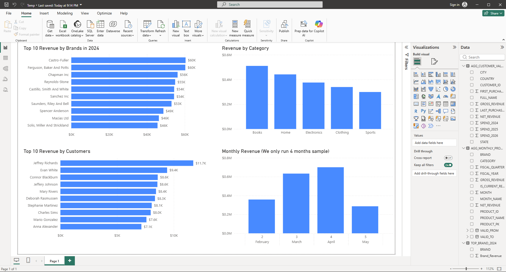

